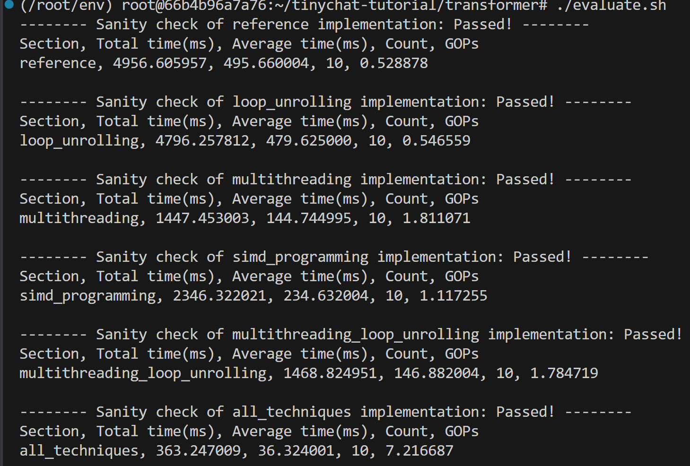

# 解题思路

## Loop Unrolling

我来为您详细解读这个矩阵乘法算法，特别是您选中的这部分代码。

### 整体算法概述

这是一个**量化矩阵乘法**算法，用于计算 `C = A × B`，其中：
- A 是激活矩阵（m × k），使用 int8 量化
- B 是权重矩阵（n × k），使用 int4 量化  
- C 是输出矩阵（m × n），浮点数格式

### 核心优化策略

1. **循环展开（Loop Unrolling）**：每次处理4列输出，减少循环开销
2. **量化计算**：使用 int8/int4 进行整数运算，最后反量化到浮点数
3. **分块处理**：按 block_size=32 分块处理，提高缓存效率

### 代码详细解读

这部分代码实现了 **int4 权重的解码和乘加运算**：

#### 1. 权重解码过程
```cpp
uint8_t packed_byte0 = *w0_int4++;
signed char val0_1 = (packed_byte0 & 0x0F) - 8.0;  // 低4位
signed char val0_2 = (packed_byte0 >> 4) - 8.0;   // 高4位
```

**关键点**：
- 每个 `uint8_t` 存储两个 int4 权重（4位 + 4位）
- 使用位运算分离：`& 0x0F` 取低4位，`>> 4` 取高4位
- **减8操作**：将 [0,15] 映射到 [-8,7]，这是 int4 的数值范围


我来详细解释这两个位运算操作的含义：

### `(packed_byte0 & 0x0F)` - 取低4位

- `0x0F` 的二进制表示是 `0000 1111`
- `&` 是位与运算，只有两个位都为1时结果才为1

#### 示例
假设 `packed_byte0 = 0x7A`（二进制：`0111 1010`）
```
packed_byte0:  0111 1010
0x0F:          0000 1111
结果:          0000 1010  (0x0A)
```

#### 作用
提取字节的低4位（右边4位），得到第一个 int4 权重值

### `(packed_byte0 >> 4)` - 右移4位

- `>>` 是右移运算，将二进制数向右移动指定位数
- 右移4位相当于除以16
- `>>` 是右移运算，将二进制数向右移动指定位数
- 右移4位相当于除以16

### 示例
同样假设 `packed_byte0 = 0x7A`（二进制：`0111 1010`）
```
packed_byte0:  0111 1010
右移4位后:     0000 0111  (0x07)
```

### 作用
提取字节的高4位（左边4位），得到第二个 int4 权重值


#### 2. QM_x86 架构的特殊处理

根据注释，QM_x86 的权重排列顺序是：
```
原始顺序：(w0,w1), (w2,w3), (w4,w5), ..., (w62,w63)
QM_x86顺序：(w0,w32), (w1,w33), (w2,w34), ..., (w31,w63)
```

这意味着：
- 第一个字节包含 w0 和 w32
- 第二个字节包含 w1 和 w33
- 以此类推...

### 性能优势

1. **内存效率**：int4 权重比 int8 节省一半内存
2. **计算效率**：整数运算比浮点运算快
3. **向量化友好**：循环展开便于编译器优化
4. **缓存友好**：分块处理减少缓存未命中

<br>

<br>

## Multithreading

### 核心思路
将矩阵乘法按**列维度**进行并行化，每个线程负责计算输出矩阵C的不同列范围，实现计算加速。

### 实现要点

#### 1. **工作负载分配策略**
```cpp
// 按列均匀分割，确保负载均衡
threads_args[j].start = j * (n / num_thread);
threads_args[j].end = (j + 1) * (n / num_thread);
```

#### 2. **边界处理优化**
```cpp
// 最后一个线程处理剩余所有列，避免遗漏
if (j == num_thread - 1)
    threads_args[j].end = n;  // 处理到最后一列
```

#### 3. **线程生命周期管理**
- **创建阶段**：为每个线程分配工作范围并启动
- **执行阶段**：线程并行执行`multithreading_worker_func`
- **同步阶段**：等待所有线程完成计算

#### 4. **数据安全保证**
- ✅ **无数据竞争**：每个线程处理不同的列范围
- ✅ **内存隔离**：线程间不共享写操作的数据
- ✅ **原子操作**：每个线程独立计算自己的列


### 技术细节

#### 线程参数结构
```cpp
struct multithreading_thread_args {
    int start, end;                    // 列范围
    const struct matmul_params* params; // 矩阵参数
};
```

#### 核心计算流程
1. **量化预处理**：将FP32激活量化为int8
2. **并行计算**：4个线程同时处理不同列
3. **int4权重解包**：按架构特定格式处理量化权重
4. **结果累加**：每个线程独立累加计算结果

### ⚡ 性能优势
- **并行加速**：4线程并行计算，理论上可达到4倍加速
- **内存局部性**：按列分割有利于缓存命中
- **负载均衡**：均匀分配工作负载，避免线程饥饿

<br>

<br>

## SIMD Programming

根据代码实现，我来总结一下SIMD矩阵乘法的实现思路和要点：

### 整体实现思路
使用内嵌的SIMD指令集，将矩阵乘法优化为向量化计算，提高计算效率。

### 核心实现要点

#### 1. **4位权重解包**
```cpp
// x86版本：解包64个4位权重为64个8位权重
w_0 = _mm256_and_si256(raw_w, lowMask);           // 提取低4位
w_128 = _mm256_and_si256(_mm256_srli_epi16(raw_w, 4), lowMask); // 提取高4位
```

#### 2. **零点偏移处理**
```cpp
// 将权重范围从(0,15)转换为(-8,7)
w_0 = _mm256_sub_epi8(w_0, zero_point);
w_128 = _mm256_sub_epi8(w_128, zero_point);
```

#### 3. **符号处理策略**
由于`_mm256_maddubs_epi16`要求第一个参数为无符号，需要：
- 计算权重的绝对值：`ax = _mm256_sign_epi8(w_0, w_0)`
- 根据权重符号调整激活值符号：`sy = _mm256_sign_epi8(activation, w_0)`

#### 4. **SIMD点积运算**
```cpp
// 使用_mm256_maddubs_epi16进行向量化点积
dot = _mm256_maddubs_epi16(ax, sy);
```

#### 5. **量化缩放**
```cpp
// 应用量化缩放因子
acc0 = _mm256_fmadd_ps(intermediate, v_s, acc0);
```

### **x86架构 (AVX2)**
- 使用256位向量寄存器  
- 每次处理64个权重 (32字节)
- 使用`_mm256_maddubs_epi16`进行点积

### 性能优化要点

1. **内存访问优化**：按块处理，减少缓存未命中
2. **向量化**：充分利用SIMD指令并行处理多个数据
3. **量化压缩**：4位权重减少内存占用和带宽需求
4. **融合乘加**：使用FMA指令减少延迟


<br>

<br>

##  Multithreading with Loop Unrolling
结合多线程和循环展开，进一步提高计算效率。


## 各方法性能结果



